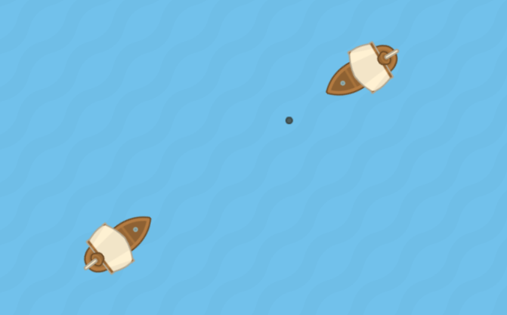

Статья предназначена для разработчиков, умеющих создавать игры и знакомых с JavaScript, но никогда раньше не писавших мультиплеерные онлайн-игры. Завершив этот туториал, вы освоите реализацию базовых сетевых компонентов в своей игре и сможете развить её во что-то большее!

источник
https://habr.com/ru/articles/418411/

фото:

Задание:
освоить мультиплеерные игры

